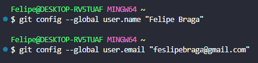
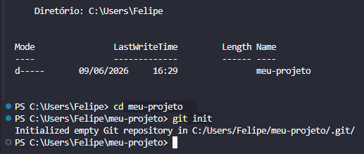
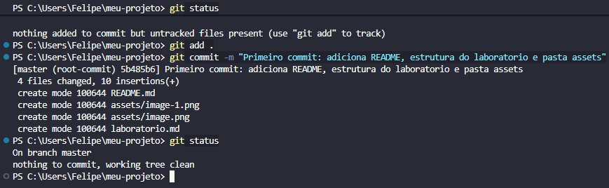
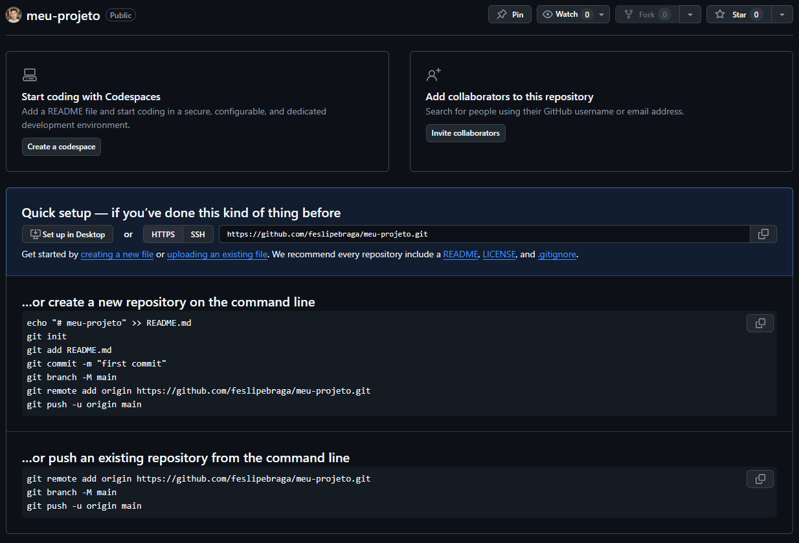
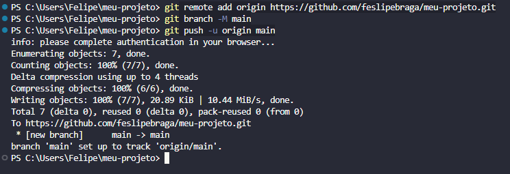

## 1. Configuração Inicial do Git 

## 2. Criar um Repositório Local

## 3. Adicionar Arquivos e Fazer Commit

## 4. Criar um Repositório no GitHub

## 5. Conectar o Repositório Local ao GitHub

